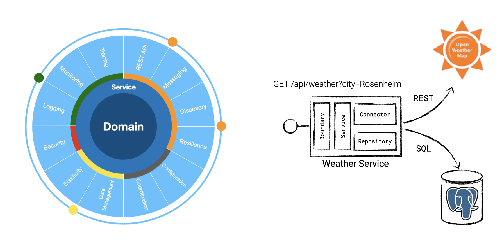

# Cloud-native Weather Service with .NET Core

This example implements a simple weather REST service using .NET Core.



## Maintainer

M.-Leander Reimer (@lreimer), <mario-leander.reimer@qaware.de>

## License

This software is provided under the Apache v2.0 open source license, read the `LICENSE`
file for details.

# Dotnet Weather

This is a simple weather application that can run in a container.

There are multiple ways how to run the application.

## Local deployment

Deployment on a local machine is not recommended – we show it here only for completeness.

First, you need to have an instance of [Microsoft SQL server](https://docs.microsoft.com/en-us/sql/database-engine/install-windows/install-sql-server)
installed and running.

Then go to the `DotnetWeather` directory and run:

```
dotnet restore
dotnet build
dotnet run
```

This is the standard way to build a .NET app from the command line. You can find more about `dotnet` commands
in the [docs](https://docs.microsoft.com/en-us/dotnet/core/tools/).

The app will be available on http://localhost:8080/. To change the app configuration, change entries
in [appsettings.json](DotnetWeather/appsettings.json) and [launchSettings.json](DotnetWeather/Properties/launchSettings.json).
You can also create different profiles for Production and Developement by creating the files appsettings.*Environment*.json.

## Run with Docker-compose

First, make sure you have [Docker](https://docs.docker.com/desktop/windows/install/) installed. Then, run in this folder:

```
docker-compose build
docker-compose up
```

You can then access the application on http://localhost:8080/.

### Dockerfile
[Dockerfile](Dockerfile) is like a recipe for building a container with our app.
The command `FROM` specifies a base image for this container. The image `mcr.microsoft.com/dotnet/sdk:6.0` already has
installed everything we need (.NET SDK) to build our app, so we use it as base.

We copy the files to our docker container with the command `COPY` and run the same commands `docker restore` and `docker build` as 
when building on a local machine.

The final command `ENTRYPOINT` specifies the command that should be run when the container is started (`docker run`).

You can build the image with the command `docker build . -t dotnet-weather:latest` and run the container
with `docker run -d -p 8080:8080 dotnet-weather:latest`. We need the flag `-p 8080:8080` to forward the port from the container
to a local port, to be able to access the app from outside of the container.
Further reference is in the [docker documentation](https://docs.docker.com/engine/reference/commandline/docker/).

### Docker-compose

`docker-compose` simplifies deploying and configuring multiple containers. In this example, we need two services to make
this app running: the app itself, and the database. Both can be run in their own container and we need to set up the containers
as well as communication between them.

The file [docker-compose.yml](docker-compose.yml) specifies these two services. We pull the database image from the docker repository,
and build the dotnet-weather image locally.

The command `docker-compose` looks in the current directory for a file named [docker-compose.yml](docker-compose.yml), and also for
[docker-compose.override.yml](docker-compose.override.yml). It first applies the configuration from the first file, and then adds or overrides
the configuration from the second file. We use the latter to set environment variables. An override can also be used to
create different docker-compose configuration in developement and production environment.

### Configure the environment

When we were deploying the app locally, we were configuring the app in [appsettings.json](DotnetWeather/appsettings.json)
(or appsettings.*Environment*.json).
With Docker, we can override the settings without touching these files. For example, to set the connection string, we can set the
environment variable *ConnectionStrings:DefaultConnection* (as you can see in [docker-compose.override.yml](docker-compose.override.yml)).

We can also set further environment variables through docker-compose. First, docker-compose looks in the [.env](.env) file
where environment variables can be defined. These default values can be overwritten in [docker-compose.yml](docker-compose.yml) and
[docker-compose.override.yml](docker-compose.override.yml). We can use the value of an environment variable in docker-compose.yml as
${VARIABLE}.

Try it: change the database password and port on which the app is exposed either in [docker-compose.override.yml](docker-compose.override.yml),
or in [.env](.env).

To distinguish configurations for Developement and Production, we can create separate docker-compose.*environment*.yml for each environment.
To build and run it, we can then execute a command such as `docker-compose -f docker-compose.yml -f docker-compose.dev.yml`, which first applies
the first file, and the second file (this happens automatically with docker-compose.override.yml).

## Run with Kubernetes

First, make sure you have build the docker image (`docker-compose build`). Then, run:

```
kubectl apply -k k8s/overlays/dev
```

This deploys the app with *dev* configuration and you can access the application on http://localhost:8082/.

So, what are actually all the files in k8s directory? There are several kinds of resources in Kubernetes (specified in field
*kind* in the file). We list a few of them here:

- Deployment. This specifies the Docker image that should be deployed, and can also specify environment variables and other configuration.
- Service. This defines policies to access the pods, for example we can bind a target port to the pod.
- ConfigMap. This specifies the configuration, we can then refer to the configuration in deployment instead of hard-writing it in multiple places.

Please refer to the [documentation](https://kubernetes.io/docs/concepts/overview/) for further info.

The single files / folders can be applied to a kubernetes cluster as `kubectl apply -f kubernetes-resource.yaml`, or with Kustomize.

### Kustomize

Kustomize is used to customize the deployment for Developement and Production environments. For this, we use the base and an overlay.
In the file kustomization.yaml, the resources are specified. The resources in an overlay can overwrite the original settings or add new services,
similar to an override with Docker.

Here, a different port is exposed for both base (8081), dev (8082) and prod (8080). Also, a different database password is set.
In the dev environment, the database port is also published outside of the cluster to make debugging easier. (In a real environment,
there would be different databases for developement and production environment as well.)

## Run with Tilt

Tilt allows us to automate the Kubernetes and Kustomize commands, as well as building the Docker images.

Once you have Tilt [installed](https://docs.tilt.dev/install.html), run `tilt up`.

The tilt server with info and status of all jobs should open. You can see the status of all services, logs, and access the application
from there.

The Tilt procedure is defined in [Tiltfile](Tiltfile). Documentation of all the functions can be found [here](https://docs.tilt.dev/api.html).